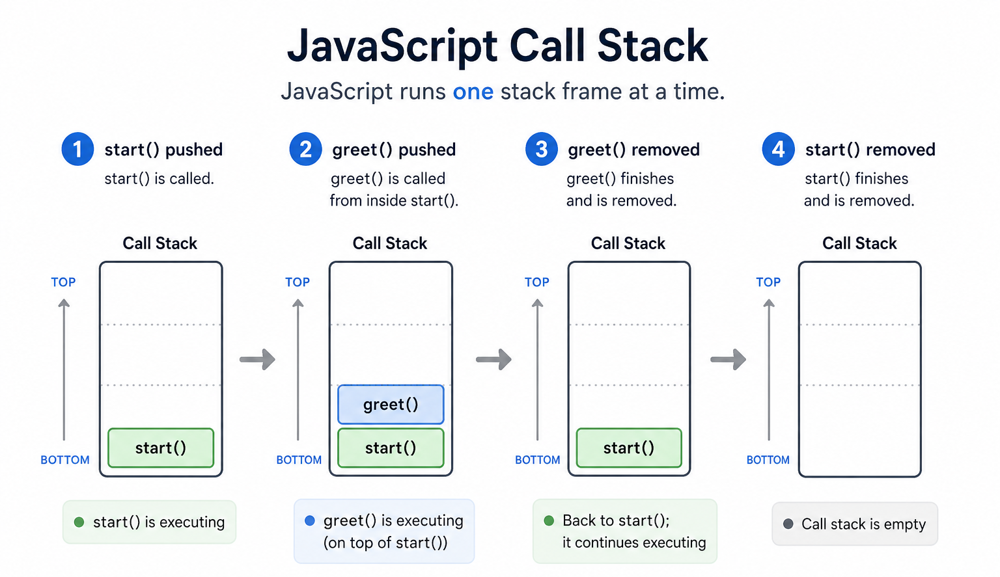
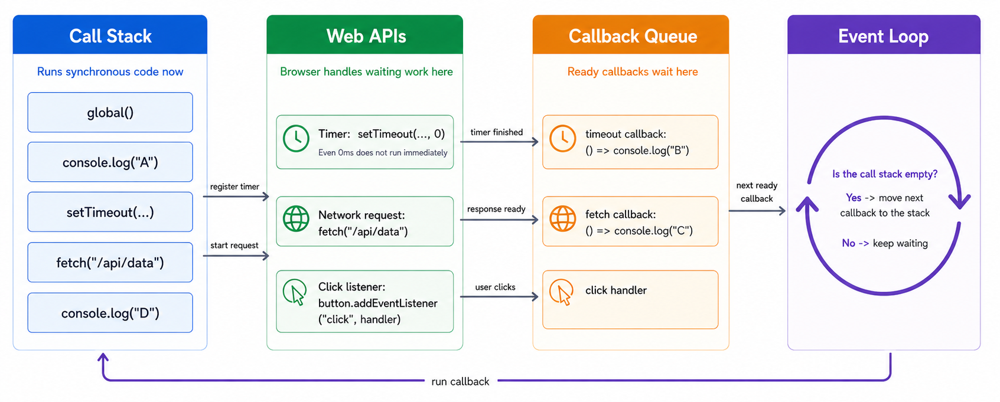

## What does it mean for JavaScript to process code?

When JavaScript runs in the browser, it does not do everything at once. It runs code in an order, keeps track of what is currently executing, and coordinates with browser-provided APIs when work needs to happen later.

This is why concepts like `setTimeout()`, event listeners, and `fetch()` feel "asynchronous": JavaScript starts something now, then handles the result later when the browser is ready.

### Smallest working example

```javascript
console.log("A");

setTimeout(() => {
  console.log("B");
}, 0);

console.log("C");
```

**What happens:**
1. `"A"` logs first.
2. The timeout is scheduled.
3. `"C"` logs next.
4. `"B"` logs later, after the current work finishes.

## Why this matters

This mental model helps explain why:

- `setTimeout(..., 0)` still does not run immediately
- Click handlers run later, when the user clicks
- `fetch()` does not block the whole page
- Long-running JavaScript can freeze the UI

## The call stack

The **call stack** is the place where JavaScript keeps track of which function is currently running.

```javascript
function greet() {
  console.log("Hello");
}

function start() {
  greet();
  console.log("Done");
}

start();
```

**What happens:**
1. `start()` is pushed onto the call stack.
2. `start()` calls `greet()`, so `greet()` is pushed on top.
3. `greet()` finishes and is removed.
4. `start()` continues and then finishes.



## Web APIs and the browser

Some work is handled outside the JavaScript call stack by browser-provided APIs.

Examples:

- `setTimeout()` asks the browser to wait for a timer
- DOM events ask the browser to watch for clicks, input, and scrolling
- `fetch()` asks the browser to make a network request

```javascript
setTimeout(() => {
  console.log("Timer finished");
}, 1000);
```

In this example, JavaScript tells the browser to start a timer. The timer itself is not sitting on the call stack for 1 second. The browser keeps track of it separately.

## The callback queue

When some delayed work is ready, its callback does not interrupt JavaScript in the middle of other work. Instead, it waits in a queue until JavaScript is ready to run it.

```javascript
console.log("Start");

setTimeout(() => {
  console.log("Timeout callback");
}, 0);

console.log("End");
```

Even with `0`, the callback still waits its turn.

## The event loop

The **event loop** is the browser mechanism that checks whether the call stack is empty and whether there is queued work ready to run.

A simple mental model is:

1. JavaScript runs whatever is currently on the call stack.
2. The browser waits until the stack is clear.
3. The event loop moves ready callbacks into execution.

```javascript
console.log("One");

setTimeout(() => {
  console.log("Two");
}, 0);

console.log("Three");
```

The output is:

```text
One
Three
Two
```



## Events in this model

Event listeners follow the same general pattern:

```javascript
const button = document.querySelector("#save");

if (button) {
  button.addEventListener("click", () => {
    console.log("Clicked");
  });
}
```

The listener is registered now, but the callback only runs later if the user clicks the button.

## `fetch()` in this model

`fetch()` also follows the same high-level idea:

```javascript
console.log("Before fetch");

fetch("/api/data")
  .then(response => response.json())
  .then(data => {
    console.log("Data loaded:", data);
  });

console.log("After fetch");
```

**What happens:**
1. `"Before fetch"` logs.
2. The request starts in the browser.
3. `"After fetch"` logs immediately.
4. The callback runs later when the response is ready.

## Why long JavaScript blocks the page

JavaScript runs one thing at a time on the call stack. If your code does heavy work for too long, the browser cannot run other callbacks, paint updates, or respond smoothly to user input.

```javascript
const start = Date.now();

while (Date.now() - start < 3000) {
  // Blocking loop for 3 seconds
}

console.log("Finished");
```

During those 3 seconds, the page may feel frozen because the call stack is busy.

:::warning
If you keep the call stack busy for too long, timers, clicks, and rendering all have to wait.
:::

## A useful rule of thumb

- **Synchronous code** runs now on the call stack
- **Web APIs** handle waiting or outside work
- **Callbacks** run later when the event loop can schedule them

That is not the full formal browser model, but it is the right mental model for understanding most beginner and intermediate async behavior.

## Summary

- JavaScript runs code on a call stack, one thing at a time.
- Browser-provided Web APIs handle timers, events, and network requests outside the stack.
- Ready callbacks wait until the stack is clear, then the event loop lets them run.
- This is why async code feels delayed and why long synchronous code can freeze the page.

## Next up

- [Timers, Scheduling, and Animation](./async_browser_apis)
- [Fetch API](./networking)
- [Events](../events/dom_events)
