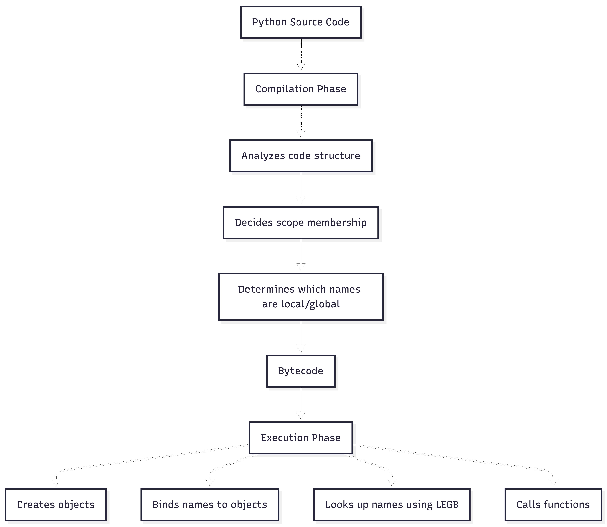

Python processes your code in two phases: **compilation** and **execution**. Understanding this split explains everything.



## Compilation: What Python sees

Python executes code in **two stages: compilation and execution**. When Python compiles a code block (such as a module or function body), it analyzes the structure of the code. This includes where names are assigned, which names are referenced, and how scopes are nested.

```python
def func():
    print(x)  # Is x local or global?
    x = 5     # Assignment makes x local
```

Python sees the assignment `x = 5` and decides: "`x` is a local name in this function." This decision happens **before** the function runs.

Compilation determines:
- Which names are local
- Which names are free variables (used but not assigned)
- Which names are global
- The structure of scopes

## Execution: What Python does

When Python runs your code, it executes the bytecode. During execution, Python:
- Creates objects
- Binds names to objects
- Looks up names using LEGB (see below)
- Calls functions
- Raises exceptions

**LEGB** is the lookup order Python uses to find names:
1. **Local** — names in the current function
2. **Enclosing** — names in enclosing functions (closures)
3. **Global** — names at module level
4. **Built-in** — names like `len`, `print`, `int`

Python searches these scopes in order, stopping at the first match. If it searches all four and finds nothing, you get a `NameError`.

Execution happens **after** compilation. The decisions made during compilation control how execution behaves.

## `Nameerror` vs `unboundlocalerror`

These two errors come from different phases:

**NameError**: Python looked everywhere (LEGB) and couldn't find the name.

```python
def func():
    print(undefined_name)  # NameError: name 'undefined_name' is not defined
```

**UnboundLocalError**: Python decided the name is local (during compilation), but you're trying to use it before it's assigned (during execution).

```python
def func():
    print(x)  # UnboundLocalError: local variable 'x' referenced before assignment
    x = 5
```

Why? Because Python saw `x = 5` during compilation and marked `x` as local. When execution reaches `print(x)`, Python looks in the local scope first, finds `x` exists (it's a local name), but it hasn't been assigned yet. Error.

This is why this works:

```python
x = 10

def func():
    print(x)  # Works fine - x is free variable, looked up in enclosing scope
```

No assignment to `x` in `func()`, so Python doesn't mark it as local. It's a free variable, looked up at runtime.

## How Python decides: Local or not?

Python uses a simple rule: if a name is **assigned** anywhere in a function, it's local to that function. The assignment doesn't have to execute, it just has to exist in the code.

```python
def func():
    if False:  # Never executes
        x = 5
    print(x)  # UnboundLocalError anyway
```

Even though `x = 5` never runs, Python saw it during compilation and marked `x` as local.

This is why `global` exists:

```python
x = 10

def func():
    global x
    print(x)  # Works - global tells Python: x is not local
    x = 5     # Modifies global x

func()
print(x)  # 5 (global x was modified)
# Output:
# 10
# 5
```

`global` tells Python during compilation: "don't mark `x` as local, it's global."

## The `global` keyword

`global` changes how Python compiles your function. Without it, an assignment makes a name local. With it, Python skips the local scope and goes straight to global.

```python
x = 1

def func():
    global x
    x = 2  # Modifies global x, not creating a local

func()
print(x)  # 2
```

During compilation, `global x` tells Python: "when you see `x` in this function, don't mark it as local—it's a global name." During execution, assignments to `x` modify the global scope.

Without `global`:

```python
x = 1

def func():
    x = 2  # Creates a local binding
    return x

func()  # 2
print(x)  # 1  (global unchanged)
```

Python sees `x = 2` during compilation and marks `x` as local. The assignment creates a local binding, leaving the global `x` untouched.

You can use `global` even if the name doesn't exist yet:

```python
def func():
    global x
    x = 10  # Creates x in global scope

func()
print(x)  # 10
```

`global` is a compile-time directive. It changes how Python analyzes your function, not how it executes.

## Compilation vs execution: The mental model

- **Compilation** analyzes code structure and decides scope membership
- **Execution** creates objects, binds names, and looks up names
- **Scope decisions** are made at compile time
- **Name lookups** happen at runtime
- **`global`** changes compile-time decisions about scope

This split explains:
- Why `UnboundLocalError` exists (local name used before assignment)
- Why `global` is needed (it changes compile-time scope decisions)
- Why scope is lexical (determined by code structure, not call site)

Everything in the names, binding, and scope guide follows from this two-phase model.
