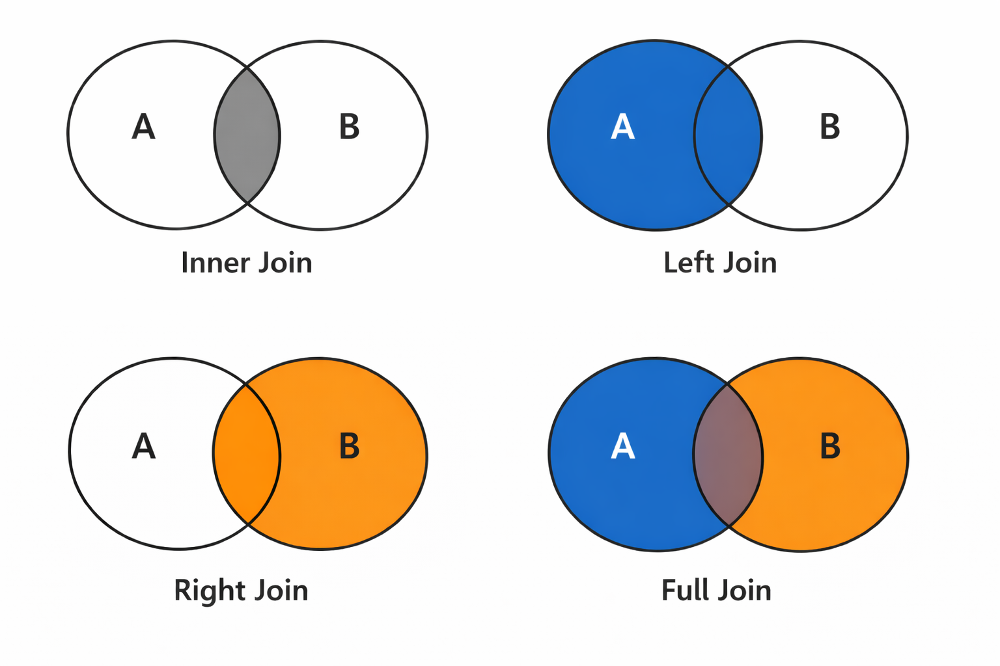

## Why relationships exist

In a well-designed database, data is **normalized**: split across multiple tables to avoid duplication and maintain consistency.

Instead of storing user information with every expense:

```
expenses table (bad design):
id | user_name | user_email        | amount | description
---|-----------|-------------------|--------|------------
1  | Alice     | alice@example.com | 50.00  | Groceries
2  | Alice     | alice@example.com | 25.00  | Coffee
3  | Bob       | bob@example.com   | 100.00 | Rent
```

You store it once in a `users` table and reference it:

```
users table:
id | email              | name
---|--------------------|-------
1  | alice@example.com  | Alice
2  | bob@example.com    | Bob

expenses table:
id | user_id | amount | description
---|---------|--------|-------------
1  | 1       | 50.00  | Groceries
2  | 1       | 25.00  | Coffee
3  | 2       | 100.00 | Rent
```

This avoids duplication and makes updates easier (change Alice's email in one place, not hundreds).

## Foreign keys

A **foreign key** is a column that references the primary key of another table. In the example above, `expenses.user_id` is a foreign key referencing `users.id`.

```sql
CREATE TABLE expenses (
  id SERIAL PRIMARY KEY,
  user_id INTEGER REFERENCES users(id),  -- Foreign key
  amount DECIMAL(10, 2) NOT NULL,
  description TEXT
);
```

Foreign keys:
- Create a **relationship** between tables
- Enforce **referential integrity** (can't create an expense with a non-existent user_id)
- Help the database understand how tables connect

## Joins: combining tables

A **join** combines rows from two (or more) tables based on a relationship between them. Instead of storing everything in one huge table, you keep related data in separate tables and use joins to **reconstruct the bigger picture** when you query. The most common type is an **INNER JOIN**.



For the examples below, we'll use these sample tables:

**users table:**
```
id | email                | name
---|----------------------|-------
1  | alice@wolfcodes.dev  | Alice
2  | bob@wolfcodes.dev    | Bob
3  | carol@wolfcodes.dev  | Carol
```

**expenses table:**
```
id | user_id | amount | description
---|---------|--------|-------------
1  | 1       | 50.00  | Groceries
2  | 1       | 25.00  | Coffee
3  | 2       | 100.00 | Rent
4  | 2       | 15.00  | Bus fare
5  | NULL    | 10.00  | Movie ticket  -- user was deleted
```

## Inner join

`INNER JOIN` returns only rows where there's a match in both tables:

```sql
SELECT users.name, expenses.amount, expenses.description
FROM users
INNER JOIN expenses ON users.id = expenses.user_id;
```

This returns:
```
name  | amount | description
------|--------|-------------
Alice | 50.00  | Groceries
Alice | 25.00  | Coffee
Bob   | 100.00 | Rent
Bob   | 15.00  | Bus fare
```

**How it works**:
1. Start with the `users` table
2. For each user, find matching rows in `expenses` where `users.id = expenses.user_id`
3. Combine the columns from both tables
4. Return only rows where there's a match

## Reading joins left-to-right

Think of a join as reading **left to right**:

```sql
FROM users                    -- Start here (left table)
INNER JOIN expenses          -- Join with this (right table)
ON users.id = expenses.user_id;  -- Match on this condition
```

The "left" table (`users`) is the one in `FROM`. The "right" table (`expenses`) is the one in `JOIN`.

## Left join

`LEFT JOIN` returns **all rows from the left table**, even if there's no match in the right table. Missing values are filled with `NULL`.

```sql
SELECT users.name, expenses.amount, expenses.description
FROM users
LEFT JOIN expenses ON users.id = expenses.user_id;
```

This returns all users, even if they have no expenses:
```
name  | amount | description
------|--------|-------------
Alice | 50.00  | Groceries
Alice | 25.00  | Coffee
Bob   | 100.00 | Rent
Bob   | 15.00  | Bus fare
Carol | NULL   | NULL          -- User with no expenses
```

**Use LEFT JOIN when**:
- You want all rows from the left table
- You want to find "users with no expenses" or similar

```sql
-- Find users with no expenses
SELECT users.name
FROM users
LEFT JOIN expenses ON users.id = expenses.user_id
WHERE expenses.id IS NULL;
```

## Right join

`RIGHT JOIN` is the mirror of `LEFT JOIN`: it returns **all rows from the right table**, even if there's no match in the left table. Missing values are filled with `NULL`.

```sql
SELECT users.name, expenses.amount, expenses.description
FROM users
RIGHT JOIN expenses ON users.id = expenses.user_id;
```

This returns all expenses, even if they don't have a matching user (though this shouldn't happen with proper foreign keys):
```
name  | amount | description
------|--------|-------------
Alice | 50.00  | Groceries
Alice | 25.00  | Coffee
Bob   | 100.00 | Rent
Bob   | 15.00  | Bus fare
NULL  | 10.00  | Movie ticket    -- Expense with no matching user
```

**Note**: In practice, `LEFT JOIN` is used much more often than `RIGHT JOIN`. You can always flip the tables to achieve the same result:

```sql
-- These are equivalent:
SELECT * FROM users RIGHT JOIN expenses ON users.id = expenses.user_id;
SELECT * FROM expenses LEFT JOIN users ON expenses.user_id = users.id;
```

Most developers prefer `LEFT JOIN` because it reads more naturally (left-to-right).

## Full outer join

`FULL OUTER JOIN` returns **all rows from both tables**, filling in `NULL` values where there's no match on either side.

```sql
SELECT users.name, expenses.amount, expenses.description
FROM users
FULL OUTER JOIN expenses ON users.id = expenses.user_id;
```

This returns all users and all expenses:
```
name  | amount | description
------|--------|-------------
Alice | 50.00  | Groceries
Alice | 25.00  | Coffee
Bob   | 100.00 | Rent
Bob   | 15.00  | Bus fare
Carol | NULL   | NULL          -- User with no expenses
NULL  | 10.00  | Movie ticket    -- Expense with no matching user
```

**When to use**: `FULL OUTER JOIN` is useful when you want to see all data from both tables, including unmatched rows on either side. However, it's rarely needed in practice—most queries use `INNER JOIN` or `LEFT JOIN`.

## Table aliases

When joining multiple tables, use **aliases** to keep queries readable:

```sql
SELECT u.name, e.amount, e.description
FROM users u
INNER JOIN expenses e ON u.id = e.user_id;
```

`u` is an alias for `users`, `e` is an alias for `expenses`. This is especially helpful with longer table names.

## Multiple joins

You can join more than two tables:

```sql
CREATE TABLE categories (
  id SERIAL PRIMARY KEY,
  name TEXT NOT NULL
);

-- expenses table now has category_id
CREATE TABLE expenses (
  id SERIAL PRIMARY KEY,
  user_id INTEGER REFERENCES users(id),
  category_id INTEGER REFERENCES categories(id),
  amount DECIMAL(10, 2) NOT NULL
);

-- Join three tables
SELECT u.name, c.name as category, e.amount
FROM expenses e
INNER JOIN users u ON e.user_id = u.id
INNER JOIN categories c ON e.category_id = c.id;
```

## Common join mistakes

### Forgetting the ON condition

```sql
-- ❌ Wrong: missing ON clause (creates a Cartesian product!)
SELECT * FROM users, expenses;

-- ✅ Correct: specify the join condition
SELECT * FROM users
INNER JOIN expenses ON users.id = expenses.user_id;
```

Without an `ON` clause, you get a **Cartesian product**: every row from the first table paired with every row from the second. This is almost never what you want and can create millions of rows!

### Using `WHERE` instead of `ON`

```sql
-- Works, but less clear
SELECT * FROM users, expenses
WHERE users.id = expenses.user_id;

-- Better: explicit join
SELECT * FROM users
INNER JOIN expenses ON users.id = expenses.user_id;
```

Modern SQL style prefers explicit `JOIN` syntax over comma-separated tables with `WHERE` conditions.

### Join explosions

Be careful with one-to-many relationships. If a user has 100 expenses, joining will create 100 rows for that user:

```sql
-- This might return way more rows than expected
SELECT users.*, expenses.*
FROM users
INNER JOIN expenses ON users.id = expenses.user_id;
```

If you just want user info, don't join:

```sql
-- Just get users
SELECT * FROM users;
```

### `NULL` in join conditions

If the foreign key column is `NULL`, the join won't match:

```sql
-- Expenses with NULL user_id won't appear in INNER JOIN
SELECT * FROM users
INNER JOIN expenses ON users.id = expenses.user_id;

-- Use LEFT JOIN to see them
SELECT * FROM expenses
LEFT JOIN users ON expenses.user_id = users.id
WHERE users.id IS NULL;  -- Expenses with no user
```

## Visualizing joins

Think of joins as a Venn diagram:

- **INNER JOIN**: The intersection (only matching rows)
- **LEFT JOIN**: The entire left circle (all left rows, matching right rows)
- **FULL OUTER JOIN**: Both circles (all rows from both tables)

## Practical example

```sql
-- Get total spending per user
SELECT 
  u.name,
  COUNT(e.id) as expense_count,
  SUM(e.amount) as total_spent
FROM users u
LEFT JOIN expenses e ON u.id = e.user_id
GROUP BY u.id, u.name
ORDER BY total_spent DESC;
```

This query:
1. Joins users with their expenses
2. Groups by user
3. Counts expenses and sums amounts per user
4. Sorts by total spent (highest first)
